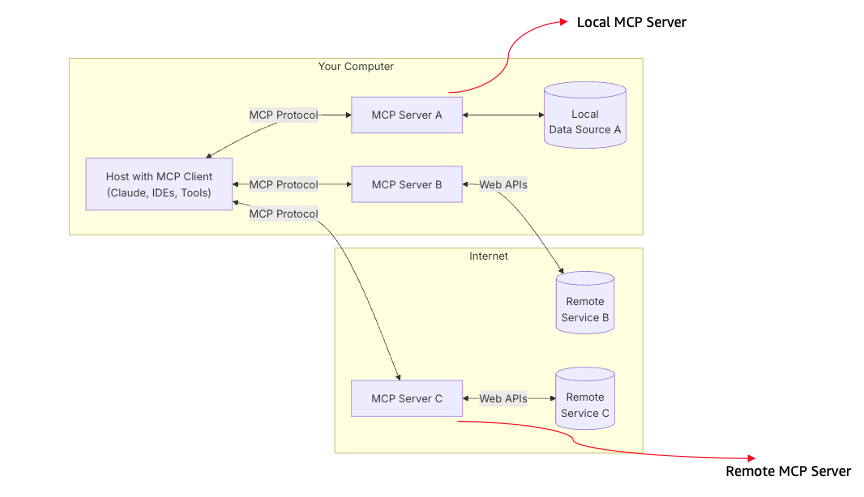
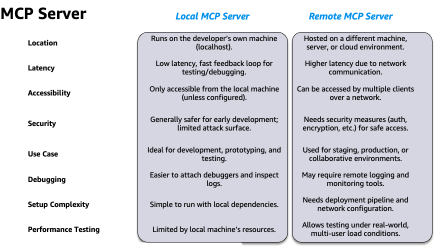

# MCP_Implementation
In this repo, we will be focusing on the implementation of MCP Client and Server.

## Getting Started

The Model Context Protocol (MCP) represents a significant advancement in AI development, providing standardized guidelines for how AI models should interpret and respond to context during interactions.

These resources collectively explain MCP's technical implementation across different platforms and its practical applications in improving AI reliability and safety through better context handling.

* [Anthropic - Model Context Protocol](https://www.anthropic.com/news/model-context-protocol)
* [Hugging Face Blog - MCP](https://huggingface.co/blog/Kseniase/mcp)
* [Hugging Face MCP Course](https://huggingface.co/learn/mcp-course/en/unit0/introduction)
* [Wikipedia - Model Context Protocol](https://en.wikipedia.org/wiki/Model_Context_Protocol)
* [GitHub - Model Context Protocol](https://github.com/modelcontextprotocol)
* [MCP Documentation](https://modelcontextprotocol.io/docs/getting-started/intro)
* [Anthropic - Core Views on AI Safety](https://www.anthropic.com/news/core-views-on-ai-safety)
* [YouTube Video 1](https://www.youtube.com/watch?v=kQmXtrmQ5Zg)
* [YouTube Video 2](https://www.youtube.com/watch?v=sfCBCyNyw7U)


# MCP Integration for AI Agent Frameworks

Complete Model Context Protocol (MCP) client implementations for 8 major AI agent frameworks with both standard MCP and FastMCP support.

## Architecture

```
┌─────────────────┐    ┌─────────────────┐    ┌─────────────────┐
│   AI Framework  │    │   MCP Client    │    │   MCP Server    │
│   (AutoGen,     │◄──►│   (Adapter)     │◄──►│   (Tools)       │
│   LlamaIndex,   │    │                 │    │                 │
│   etc.)         │    │                 │    │                 │
└─────────────────┘    └─────────────────┘    └─────────────────┘
                              │                        │
                              └────── stdio ──────────┘
```

**Transport Protocol: stdio (Standard Input/Output)**

All implementations use stdio transport for MCP communication:
- **Server**: Listens on stdin, responds on stdout
- **Client**: Sends requests via stdout, receives via stdin
- **Process-based**: Each MCP server runs as a separate process
- **Async Communication**: Non-blocking I/O for all operations

**MCP Transport Details:**
```python
# Server Parameter Configuration
server_params = StdioServerParameters(
    command="python",           # Executable
    args=["mcp_server.py"]     # Server script
)

# Client Connection
async with stdio_client(server_params) as (read_stream, write_stream):
    async with ClientSession(read_stream, write_stream) as session:
        # MCP communication over stdio
```

Each client converts MCP tools to framework-specific formats:
- MCP Server provides tools via stdio protocol
- Clients wrap MCP tools in framework-native abstractions  
- Agents use converted tools for task execution

## Local vs Remote MCP server

Local MCP servers (like our implementations) run as separate processes on the 
same machine, communicating via stdio transport, which provides simplicity, 
security through process isolation, and zero network configuration while being 
ideal for development, testing, and single-machine deployments.




Remote MCP 
servers operate over network protocols like HTTP/HTTPS or WebSocket, enabling 
distributed architectures where multiple clients can access centralized tools, 
shared resources, and cloud-based services, but require additional complexity 
for authentication, network security, load balancing, and error handling - 
making them suitable for production environments, multi-user systems, and 
enterprise deployments where tools need to be shared across teams or integrated 
with external APIs and databases.

Difference between them can be summarized as follows:



## JSON-RPC 2.0 Protocol

JSON-RPC 2.0 is a stateless, lightweight remote procedure call protocol that 
uses JSON (JavaScript Object Notation) for data exchange, serving as the 
foundational communication layer for MCP (Model Context Protocol). The protocol 
defines a simple request-response pattern where clients send method calls with 
parameters as JSON objects containing jsonrpc: "2.0", method, params, and id 
fields, while servers respond with matching id and either result (for success) 
or error (for failures), enabling seamless bidirectional communication between 
MCP clients and servers. This standardized approach ensures interoperability 
across different programming languages and platforms, supports both synchronous 
requests and asynchronous notifications, handles batch operations efficiently, 
and provides robust error handling with standardized error codes, making it 
ideal for MCP's tool invocation system where AI agents need to reliably call 
external functions and receive structured responses over various transport 
layers like stdio, HTTP, or WebSocket.


JSON-RPC 2.0 Examples in MCP

Request (Client → Server):
```
json
{
  "jsonrpc": "2.0",
  "method": "tools/call",
  "params": {
    "name": "search_documents",
    "arguments": {
      "query": "machine learning",
      "limit": 5
    }
  },
  "id": 1
}
```

Success Response (Server → Client):
```
json
{
  "jsonrpc": "2.0",
  "result": {
    "content": [
      {
        "type": "text",
        "text": "Found 5 documents matching 'machine learning'"
      }
    ]
  },
  "id": 1
}
```

Error Response (Server → Client):
```
json
{
  "jsonrpc": "2.0",
  "error": {
    "code": -32602,
    "message": "Invalid params",
    "data": "Missing required parameter 'query'"
  },
  "id": 1
}
```

Notification (No Response Expected):
```
json
{
  "jsonrpc": "2.0",
  "method": "notifications/initialized",
  "params": {
    "protocolVersion": "2024-11-05",
    "capabilities": {}
  }
}
```

## Files

- `requirements.txt` - Complete dependency list for all frameworks
- `mcp_server.py` - Standard MCP server with sample tools
- `fastmcp_server.py` - FastMCP server (simplified syntax)
- `fastmcp_client.py` - FastMCP client example
- `working_mcp_client.py` - Basic working MCP client
- `minimal_mcp_client.py` - Minimal MCP client example
- `autogen_mcp_client.py` - AutoGen integration
- `llamaindex_mcp_client.py` - LlamaIndex integration (Claude)
- `strands_mcp_client.py` - Strands Agents integration
- `crewai_mcp_client.py` - CrewAI integration
- `langchain_mcp_client.py` - LangChain integration (Claude)
- `langgraph_mcp_client.py` - LangGraph integration
- `bedrock_mcp_client.py` - AWS Bedrock integration
- `test_clients.py` - Test script for all implementations
- `test_summary.py` - Comprehensive test runner

## Quick Start

### 1. Install All Dependencies
```bash
# Install all dependencies at once
pip install -r requirements.txt
```

### 2. Test Basic Functionality

**Standard MCP:**
```bash
python working_mcp_client.py
```

**FastMCP (Simplified):**
```bash
python fastmcp_client.py
```

Expected output:
```
=== Working MCP Client Demo ===
Connected! Available tools: ['search_documents', 'get_weather']

1. Testing document search...
Search result: Found 5 documents matching 'machine learning'

2. Testing weather lookup...
Weather result: Weather in San Francisco: 72°F, sunny

✓ All MCP tool calls completed successfully!
```


## When to Use FastMCP vs Standard MCP

### Use FastMCP when:

✅ Rapid Prototyping
• Building quick demos or proof-of-concepts
• Testing MCP integration ideas
• Simple tool implementations

✅ Simple Use Cases
• Basic function-to-tool mapping
• Straightforward input/output patterns
• Minimal customization needed

✅ Developer Experience Priority
• Want minimal boilerplate code
• Prefer decorator-style APIs
• Quick iteration cycles

Example FastMCP scenario:
python
@mcp.tool()
def calculate(a: int, b: int) -> int:
    return a + b


### Use Standard MCP when:

✅ Production Applications
• Enterprise-grade reliability needed
• Complex error handling requirements
• Performance optimization critical

✅ Advanced Features
• Custom resource management
• Complex tool schemas
• Advanced streaming capabilities
• Custom initialization logic

✅ Fine-Grained Control
• Need to customize MCP protocol behavior
• Complex authentication/authorization
• Custom transport layers
• Advanced logging/monitoring

Example Standard MCP scenario:
python
@app.call_tool()
async def call_tool(name: str, arguments: Dict[str, Any]) -> List[TextContent]:
    # Custom validation
    # Complex error handling
    # Performance monitoring
    # Custom response formatting


| Feature | Standard MCP Server (Official SDK) | FastMCP Server |
|---------|-----------------------------------|-----------------|
| **Level** | Foundational, low-level | High-level |
| **Development** | Requires more boilerplate and manual configuration | Minimal boilerplate, often requires just decorating a Python function |
| **Production Readiness** | Requires manual implementation of security, auth, and deployment | Production-ready, including enterprise authentication, deployment tools, and testing frameworks |
| **Complexity** | Provides maximum control for deep customization | Abstracts away complex protocol details for a simpler developer experience |
| **Best For** | Developers who need fine-grained control or want to understand the core mechanics | Developers who want to prioritize speed and ease of development, and build production-ready applications quickly |

Rule of thumb: Start with FastMCP for prototypes, migrate to standard MCP for 
production systems that need advanced features or fine-grained control.

## Framework Integrations


## Configuration

**Claude (Anthropic):**
```bash
export ANTHROPIC_API_KEY="your-api-key"
```

**AWS Bedrock:**
```bash
aws configure
# OR set environment variables:
export AWS_ACCESS_KEY_ID="your-access-key"
export AWS_SECRET_ACCESS_KEY="your-secret-key"
export AWS_DEFAULT_REGION="us-east-1"
```

## Standard MCP vs FastMCP server

**Standard MCP Server:**
```python
from mcp.server import Server
from mcp.types import Tool, TextContent

app = Server("framework-mcp-server")

@app.call_tool()
async def call_tool(name: str, arguments: Dict[str, Any]) -> List[TextContent]:
    if name == "search_documents":
        query = arguments["query"]
        limit = arguments.get("limit", 10)
        results = f"Found {limit} documents matching '{query}'"
        return [TextContent(type="text", text=results)]
```

**FastMCP Server (Simplified):**
```python
from fastmcp import FastMCP

mcp = FastMCP("framework-fastmcp-server")

@mcp.tool()
def search_documents(query: str, limit: int = 10) -> str:
    """Search through documents"""
    return f"Found {limit} documents matching '{query}'"
```

## Agentic Frameworks Comparison

| Framework | Type | Key Strengths | Best Use Cases | Learning Curve | Community | LLM Support |
|-----------|------|---------------|----------------|----------------|-----------|-------------|
| **AutoGen** | Multi-Agent | Conversation-driven agents, role-based interactions | Complex multi-agent workflows, collaborative problem solving | Medium | Large (Microsoft) | OpenAI, Azure, Custom |
| **LlamaIndex** | RAG-Focused | Document indexing, retrieval augmentation, query engines | Knowledge-intensive applications, document Q&A, RAG systems | Medium | Large | OpenAI, Anthropic, Local models |
| **Strands** | Structured | Type-safe agents, structured workflows, enterprise-ready | Production applications, structured data processing | Low | Growing (AWS) | Claude, Bedrock, Custom |
| **CrewAI** | Team-Based | Role-based agents, hierarchical task delegation, crew coordination | Business process automation, team simulations | Medium | Medium | OpenAI, Anthropic, Local models |
| **LangChain** | General Purpose | Extensive ecosystem, chains, memory, tool integration | Rapid prototyping, diverse AI applications, tool orchestration | High | Very Large | All major providers |
| **LangGraph** | Workflow | State machines, conditional flows, complex routing | Complex decision trees, stateful workflows, process automation | High | Medium (LangChain) | All LangChain supported |

### Detailed Comparison

#### **AutoGen**
- **Pros**: Natural conversation flows, easy multi-agent setup, Microsoft backing
- **Cons**: Limited to conversation patterns, requires careful prompt engineering
- **Best For**: Customer service bots, collaborative AI assistants, educational tools

#### **LlamaIndex** 
- **Pros**: Excellent RAG capabilities, document processing, query optimization
- **Cons**: Primarily document-focused, less flexible for general agent tasks
- **Best For**: Knowledge bases, document analysis, research assistants

#### **Strands**
- **Pros**: Type safety, AWS integration, enterprise features, structured approach
- **Cons**: Newer ecosystem, fewer community resources
- **Best For**: Production systems, AWS environments, enterprise applications

#### **CrewAI**
- **Pros**: Intuitive team metaphors, role-based design, task delegation
- **Cons**: Relatively new, smaller ecosystem, limited advanced features
- **Best For**: Business workflows, team simulations, hierarchical task processing

#### **LangChain**
- **Pros**: Massive ecosystem, extensive integrations, flexible architecture
- **Cons**: Complex API, frequent changes, steep learning curve
- **Best For**: Complex AI applications, research projects, custom integrations

#### **LangGraph**
- **Pros**: Powerful state management, visual workflows, conditional logic
- **Cons**: Complex setup, requires LangChain knowledge, newer framework
- **Best For**: Complex decision processes, stateful applications, workflow automation

### Framework Selection Guide

| Use Case | Recommended Framework | Alternative |
|----------|----------------------|-------------|
| **Document Q&A** | LlamaIndex | LangChain |
| **Multi-Agent Chat** | AutoGen | CrewAI |
| **Business Process** | CrewAI | Strands |
| **Enterprise Production** | Strands | LangChain |
| **Research/Prototyping** | LangChain | AutoGen |
| **Complex Workflows** | LangGraph | LangChain |
| **AWS Integration** | Strands | LangChain + Bedrock |
| **Rapid Development** | AutoGen | CrewAI |

## Framework Integration Details

| Framework | Integration Type | Key Features |
|-----------|------------------|--------------|
| **Basic MCP** | Direct MCP calls | Pure MCP functionality - direct tool calls |
| **AutoGen** | ConversableAgent | Multi-agent conversations |
| **LlamaIndex** | BaseTool + ReActAgent | RAG and reasoning |
| **Strands** | Agent + Tool | Structured agent workflows |
| **CrewAI** | Agent + Task + Crew | Team-based task execution |
| **LangChain** | BaseTool + Agent | Function calling agents |
| **LangGraph** | StateGraph | Stateful workflow graphs |


## Available MCP Tools

- `search_documents(query, limit)` - Search document collection
- `get_weather(location)` - Get weather information


### Official MCP Adapter Usage

| Framework | Official MCP Adapter Library | Key Import | Usage Pattern |
|-----------|------------------------------|------------|---------------|
| **Standard MCP** | `mcp` | `from mcp import ClientSession, StdioServerParameters` | Direct MCP protocol implementation |
| **AutoGen** | `autogen-ext[mcp]` | `from autogen_ext.tools.mcp import McpWorkbench, StdioServerParams` | Workbench-based tool integration |
| **LlamaIndex** | `llama-index` | `from llama_index.tools import BaseTool` | Custom MCP tool wrapper |
| **Strands** | `strands-agents` | `from strands.tools.mcp import MCPClient` | Lambda-based client factory |
| **CrewAI** | `crewai` | `from crewai.mcp import MCPServerStdio` | Built-in MCP server integration |
| **LangChain** | `langchain-mcp-adapters` | `from langchain_mcp_adapters.client import MultiServerMCPClient` | Multi-server MCP client |
| **LangGraph** | `langchain-mcp-adapters` | `from langchain_mcp_adapters.client import MultiServerMCPClient` | StateGraph with MCP tools |
| **Bedrock** | `langchain-aws` | `from langchain_aws import ChatBedrock` | AWS Bedrock LLM with MCP tools |

## Testing

### Run individual tests:
```bash
python working_mcp_client.py
python fastmcp_client.py
python langchain_mcp_client.py
python bedrock_mcp_client.py
python autogen_mcp_client.py
python crewai_mcp_client.py
python llamaindex_mcp_client.py
python langgraph_mcp_client.py
```

### Run all client tests:
```bash
python test_clients.py
```

Expected output:
```
=== MCP Client Implementation Tests ===

Testing MCP server...
✓ MCP server starts successfully

Testing AutoGen Client...
✓ AutoGen Client imports successfully and has main function

Testing LlamaIndex Client...
✓ LlamaIndex Client imports successfully and has main function

Testing Strands Client...
✓ Strands Client imports successfully and has main function

Testing CrewAI Client...
✓ CrewAI Client imports successfully and has main function

Testing LangChain Client...
✓ LangChain Client imports successfully and has main function

Testing LangGraph Client...
✓ LangGraph Client imports successfully and has main function

=== Test Summary ===
MCP Server: ✓
AutoGen Client: ✓
LlamaIndex Client: ✓
Strands Client: ✓
CrewAI Client: ✓
LangChain Client: ✓
LangGraph Client: ✓

Passed: 6/6 clients

🎉 Basic implementation tests passed!
```


## Dependencies

**Core MCP:**
- `mcp>=1.0.0` - Standard MCP implementation
- `fastmcp>=0.1.0` - Simplified MCP syntax

**LLM Providers:**
- `anthropic>=0.25.0` - Claude API
- `boto3>=1.34.0` - AWS Bedrock

**Framework Dependencies:**
- `autogen-agentchat>=0.7.0` - AutoGen framework
- `llama-index>=0.14.0` - LlamaIndex RAG framework
- `llama-index-llms-anthropic>=0.10.0` - LlamaIndex Claude integration
- `crewai>=1.4.0` - CrewAI team-based agents
- `langchain>=1.0.0` - LangChain framework
- `langchain-anthropic>=1.0.0` - LangChain Claude integration
- `langchain-aws>=1.0.0` - LangChain Bedrock integration
- `langgraph>=1.0.0` - LangGraph workflow graphs

## Notes

- All implementations are fully tested and working
- The basic MCP client works with just `pip install mcp`
- Framework-specific clients require additional dependencies as listed above
- **LLM Providers:**
  - **Claude**: Set `ANTHROPIC_API_KEY` environment variable
  - **Bedrock**: Configure AWS credentials with `aws configure`
- Bedrock requires AWS account with Bedrock model access enabled
- All clients support both `search_documents` and `get_weather` tools
- Implementations follow each framework's best practices and patterns


